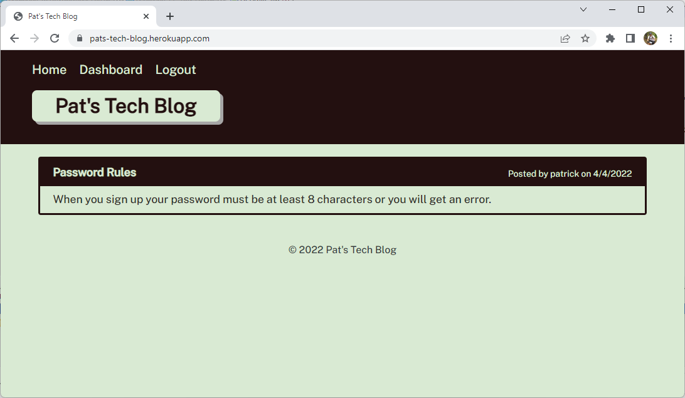

# Pat's Tech Blog

## Description

  - This is a full-stack blog application built with express, handlebars, sequelize, mysql2 and uses the MVC paradigm.
  - I wanted to build a full stack web application to demonstrate all of the skills I have learned so far.
  - This application provides a tech blog so techie types can write about the technologies they use or want to use and others can comment on their posts.
  - This application makes it easy to collaboarate with other technical users about technology.
  - I leanred a lot during this project. I learned how to encrypt passwords with bcrypt, ORM and session management with sequelize and express-session, and I learned about MVC and templates with handlebars.

## Table of Contents

  - [Installation](#installation)
  - [Usage](#usage)
  - [License](#license)
  - [Contributing](#contributing)
  
  - [Questions](#questions)

## Installation

  - git clone https://github.com/patrickaregan/pats-tech-blog.git
  - From MySQL client, source the "db/schema.sql" file.
  - From terminal, run "npm i" in the root directory to install dependencies.
  - From terminal, run "npm start" to start the application.

## Usage

  - To use the project locally: open a browser to: http://localhost:3001/
  - To use the project online: open a browser to: https://dashboard.heroku.com/apps/pats-tech-blog

  

## License

  - MIT

## Contributing

  - My contribution rule is to treat others with respect and if you see any violations please contact me at my email below.  
  

## Questions

- [GitHub Profile](https://github.com/patrickaregan)
- If you have additional questions please email me at patrickaregan@gmail.com

